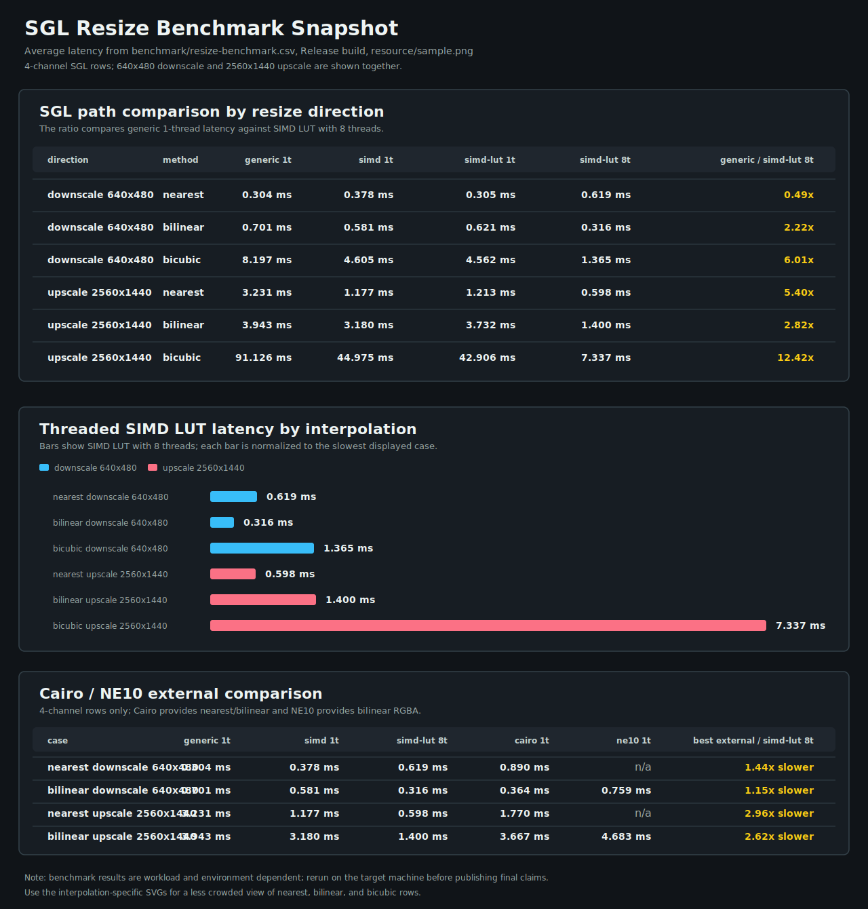

<!--
SPDX-License-Identifier: MIT

Copyright (c) 2025 Dylan Hong

This file is released under the MIT License.
For conditions of distribution and use, see the LICENSE file.
-->

Project Build and Run Guide
===========================

Overview
--------
This project uses CMake and Make to build and run a target application.
The default target name is `resize`, and the project supports native
execution as well as cross-compilation for AArch64 using different toolchains.

Directory Layout
----------------
- TOPDIR      : Root directory of the project (where the Makefile is located)
- WORKSPACE   : Same as TOPDIR
- BUILD       : Build output directory (default: <TOPDIR>/build)
- resource/   : Contains input resources (e.g., sample images)
- script/     : Toolchain configuration files

Prerequisites
-------------
- CMake
- Make
- A C/C++ compiler (LLVM or GNU toolchain)
- cppcheck (optional; enables build-time static analysis)
- qemu-aarch64 (required only for non-host execution)
- Linux environment (nproc is used to determine parallel jobs)

Configuration Variables
-----------------------
The following variables can be overridden from the command line:

- TOOLCHAIN
  Selects the toolchain to use.
  Possible values:
    - llvm (default)
    - gnu
    - aarch64-none-linux-llvm
    - aarch64-none-linux-gnu

  Example:
    make TOOLCHAIN=gnu

- BUILD_TYPE
  Specifies the CMake build type.
  Possible values:
    - Debug
    - Release (default)
    - RelWithDebInfo
    - MinSizeRel

  Example:
    make BUILD_TYPE=Debug

- NPROC
  Number of parallel build jobs.
  Default: number of available CPU cores.

- V
  Verbose build output.
  Set to non-zero to enable verbose mode.

  Example:
    make V=1

- WITH_CPPCHECK
  Enables cppcheck analysis for the SGL library sources. Test applications are
  excluded. Defaults to ON, and configuration fails when cppcheck is
  unavailable. Set it to OFF to build without static analysis.

  Example:
    make WITH_CPPCHECK=OFF

- WITH_CPPCHECK_MISRA
  Enables the cppcheck MISRA C:2012 addon for C sources. Defaults to ON and
  requires `WITH_CPPCHECK=ON`. The open-source addon provides partial MISRA
  coverage.

  Example:
    make WITH_CPPCHECK_MISRA=OFF

- CPPCHECK_MISRA_RULE_TEXTS
  Optional path to a licensed MISRA C rule-headlines file. When omitted,
  diagnostics contain rule identifiers without the proprietary rule text.

  Example:
    make WITH_CPPCHECK_MISRA=ON \
      CPPCHECK_MISRA_RULE_TEXTS=/path/to/misra-rule-headlines.txt

- WITH_CPPCHECK_WARNINGS_AS_ERRORS
  Makes cppcheck findings, including enabled MISRA findings, fail the build by
  passing `--error-exitcode=1`. Defaults to OFF.

  Example:
    make WITH_CPPCHECK_WARNINGS_AS_ERRORS=ON

- CPPCHECK_MAX_CTU_DEPTH
  Sets the maximum Cppcheck cross-translation-unit analysis depth used by the
  standalone report script. Defaults to 4.

  Example:
    make cppcheck-report CPPCHECK_MAX_CTU_DEPTH=6

- WITH_COMPILER_WARNINGS
  Enables the commonly used `-Wall` and `-Wextra` compiler warnings for C and
  C++. Defaults to ON.

  Example:
    make WITH_COMPILER_WARNINGS=OFF

Build Targets
-------------
- all
  Default target. Same as `build`.

- config
  Configure the project using CMake.

  Example:
    make config

- build
  Build the project using CMake.

  Example:
    make build

- clean
  Clean build artifacts.

  Example:
    make clean

- distclean
  Remove the entire build directory.

  Example:
    make distclean

- cppcheck-report
  Runs the standalone Cppcheck report script with all available Cppcheck
  checker classes enabled, exhaustive checking, inconclusive findings,
  library checks, CTU analysis and the optional MISRA C:2012 addon. The report
  is saved under `report/<date>-<commit>/` and includes XML, text, active
  checker, MISRA addon summary, summary and metadata files. Cppcheck's native
  `--checkers-report` output lists built-in checker state, so it may still say
  `Misra is not enabled` even when MISRA addon findings are present in the XML
  and text reports. When `cppcheck-htmlreport` is installed, an HTML report is
  also generated at `report/<date>-<commit>/html/index.html`.

  Example:
    make cppcheck-report

Running the Application
-----------------------
- run
  Builds the project (if needed) and runs the target binary.

  Example:
    make run

Execution Behavior:
- If HOSTENV is TRUE (default for llvm and gnu toolchains),
  the binary is executed directly on the host system.
- Otherwise, the binary is executed using qemu-aarch64 with the
  sysroot specified in build/sysroot.txt.

The default execution command is equivalent to:

  <BUILD>/<BUILD_TYPE>/bin/resize resource/sample.png

Resize Benchmark
----------------
The `resize` test application writes a benchmark CSV at:

  benchmark/resize-benchmark.csv

Resized PNG outputs for visual debugging are written separately at:

  build/output/

Open `tools/resize-benchmark-viewer.html` in a browser to inspect the CSV as
latency and thread-scaling charts. The viewer can also export a representative
Markdown snapshot for README or release notes, and download the current chart
view or the external backend comparison chart as SVG.

By default the benchmark only builds SGL rows. Configure with
`-DWITH_BENCHMARK_COMPARE=ON` when optional comparison backends are needed:

| Backend | Methods | Source |
| --- | --- | --- |
| Cairo + pixman | nearest, bilinear | fixed test-only tarballs, built with Meson/Ninja |
| NE10 | bilinear | fixed test-only tarball, built with CMake |

The benchmark records the source channel count in the CSV. When the input path
ends in `sample.png`, the test runner uses prebuilt sibling inputs named
`sample-1ch.png`, `sample-2ch.png`, `sample-3ch.png`, and `sample-4ch.png` if
all four exist; otherwise it runs the single PNG passed on the command line.
The comparison rows use the same output sizes, repeat count, and CSV format as
the SGL rows. SGL `generic` and `simd` rows measure the convenience path that
builds a temporary lookup table per resize call. SGL `generic-lut` and
`simd-lut` rows build the lookup table once per benchmark case and reuse it in
the timed loop, which represents repeated resizing with fixed geometry.
External backends are recorded only as 1-thread baseline rows because they do
not consume the SGL threadpool. Comparison dependencies are downloaded into
`downloads/` and are built only when `WITH_BENCHMARK_COMPARE` is enabled. Cairo
and NE10 rows are raw backend timing checks and should be treated as
experimental until pixel-accuracy validation is added. Cairo and NE10 are
recorded only for 4 channel rows; NE10 provides a bilinear RGBA resize API, so
it is recorded only for bilinear rows.

The default sample image is 1920x1080, so 1920x1080 rows are identity-size
cases and are not used as representative backend comparisons below.

The following SVG is a sample run from `resource/sample.png`. It highlights
SGL path comparisons, including SIMD single-thread rows and the no-external-LUT
convenience path, and includes the 4-channel Cairo/NE10 comparison rows. Treat
it as a benchmark snapshot, not a universal claim; CPU model, clock policy,
compiler, build flags, and input image all affect the result.



| Environment | Value |
| --- | --- |
| Host CPU | Snapdragon(R) X 12-core X1E80100 |
| Host base clock | 3.42 GHz |
| WSL visible CPU | aarch64, Qualcomm vendor, 8 logical CPUs visible to Linux |
| WSL CPU model string | not reported by Linux inside WSL2 |
| OS | Windows on WSL2, Linux 6.18.33.1-microsoft-standard-WSL2 aarch64 |
| Compiler | GCC 13.3.0, Ubuntu 13.3.0-6ubuntu2~24.04.1 |
| Build | Release |
| Input | resource/sample.png |

Experimental nearest backend timing, using average latency:

| Scenario | SGL generic 1t | SGL simd 1t | SGL simd-lut 1t | SGL simd-lut 8t | Cairo 1t |
| --- | ---: | ---: | ---: | ---: | ---: |
| nearest 1280x720 | 0.792 ms | 0.941 ms | 0.954 ms | 0.382 ms | 0.564 ms |
| nearest 2560x1440 | 3.083 ms | 1.182 ms | 1.212 ms | 0.630 ms | 1.980 ms |

Experimental bilinear backend timing, using average latency:

| Scenario | SGL generic 1t | SGL simd 1t | SGL simd-lut 1t | SGL simd-lut 8t | Cairo 1t | NE10 1t |
| --- | ---: | ---: | ---: | ---: | ---: | ---: |
| bilinear 1280x720 | 5.164 ms | 1.286 ms | 1.377 ms | 0.437 ms | 0.993 ms | 1.424 ms |
| bilinear 2560x1440 | 21.915 ms | 3.486 ms | 3.435 ms | 1.149 ms | 3.894 ms | 4.100 ms |

Representative optimized SGL thread scaling, using average latency:

| Scenario | simd-lut 1t | simd-lut 8t | Speedup |
| --- | ---: | ---: | ---: |
| bicubic 2560x1440 | 41.594 ms | 7.385 ms | 5.63x |
| bicubic 1280x720 | 14.713 ms | 2.804 ms | 5.25x |
| bilinear 2560x1440 | 3.435 ms | 1.149 ms | 2.99x |
| nearest 1280x720 | 0.954 ms | 0.382 ms | 2.50x |
| nearest 2560x1440 | 1.212 ms | 0.630 ms | 1.92x |

Notes
-----
- Toolchain files are expected in:
    script/toolchain/<TOOLCHAIN>.cmake
- qemu-aarch64 is only required for non-host (cross) execution.
- The default input argument is `resource/sample.png`.

Memory Pool
-----------
SGL uses `sgl_malloc`, `sgl_calloc`, and `sgl_free` internally. Their calling
conventions match `malloc`, `calloc`, and `free`, but they never use the C
runtime heap. A caller-owned pool must be registered before using an SGL
operation that allocates memory:

```c
static unsigned char sgl_pool[1024 * 1024];

if (sgl_memory_pool_initialize(sgl_pool, sizeof(sgl_pool)) != SGL_SUCCESS) {
    /* handle initialization failure */
}

/* Use SGL normally. */

if (sgl_memory_pool_deinitialize() != SGL_SUCCESS) {
    /* Pool allocations are still alive. */
}
```

The allocator supports variable-size blocks, splits and coalesces free blocks,
and serializes allocation/free operations when thread support is enabled.
Initialize and deinitialize the pool outside concurrent SGL activity.
