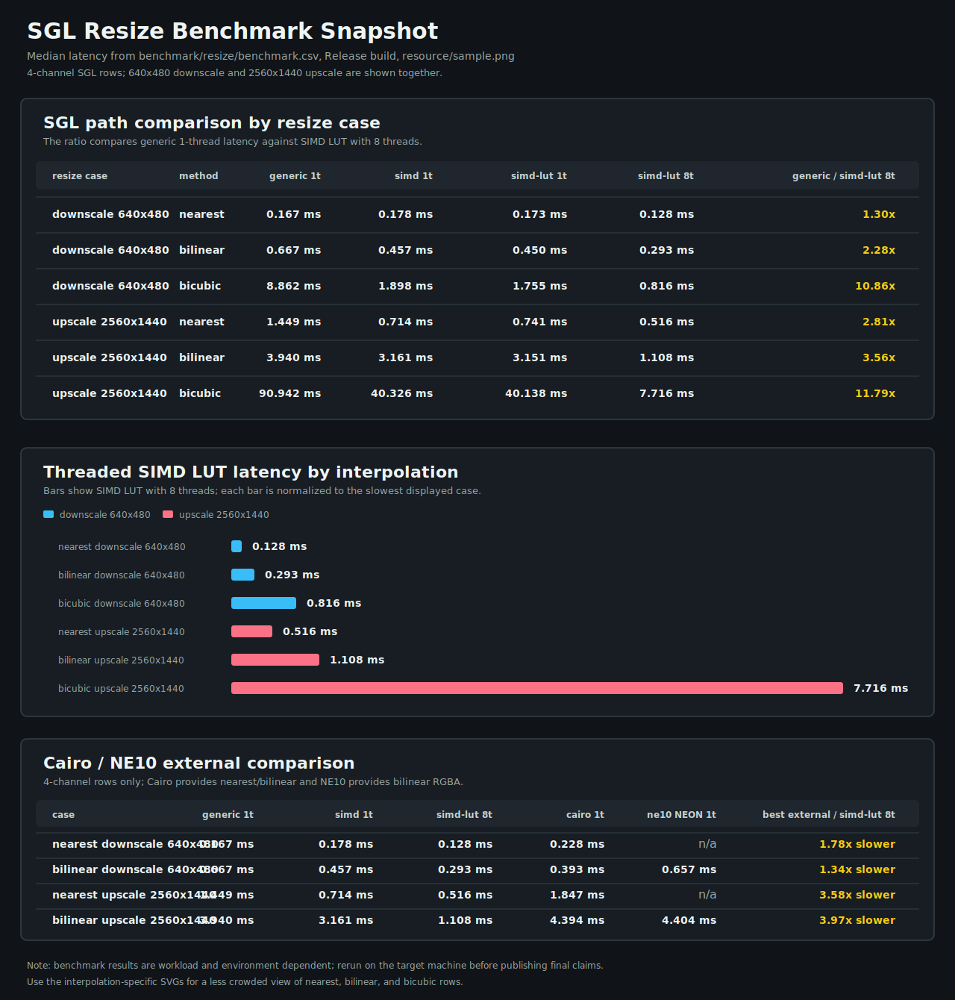
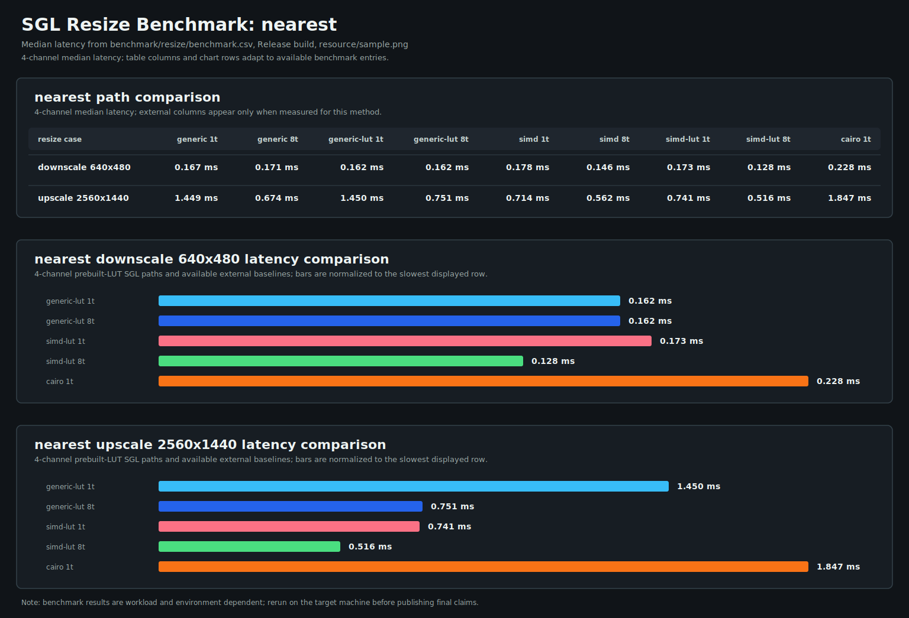
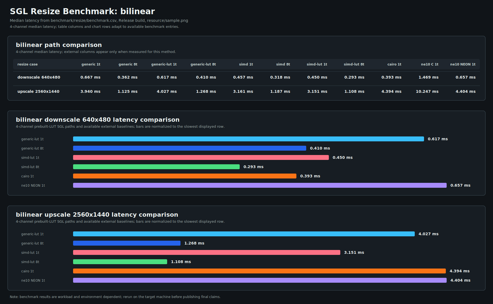
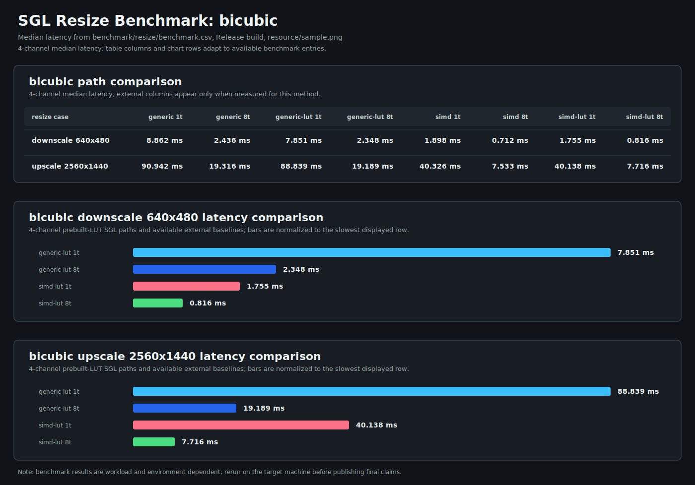

<!--
SPDX-License-Identifier: MIT

Copyright (c) 2025 Dylan Hong

This file is released under the MIT License.
For conditions of distribution and use, see the LICENSE file.
-->

Project Build and Run Guide
===========================

Overview
--------
Simple Graphics Library (SGL) is a small C graphics-processing library focused
on explicit memory management, portable scalar image operations, and optional
ARM NEON acceleration. The repository also contains test applications for
regression checks, PNG-based resize benchmarking, and AArch64 QEMU execution.

The default Make target configures and builds the project. `make run` builds
first, then runs the selected test application. Native host builds and AArch64
cross builds are both supported through CMake toolchain files.

Contents
--------
- [Overview](#overview)
- [Project Status](#project-status)
- [Quick Start](#quick-start)
- [Directory Layout](#directory-layout)
- [Prerequisites](#prerequisites)
- [Platform Package Setup](#platform-package-setup)
- [Configuration Variables](#configuration-variables)
- [Build Targets](#build-targets)
- [Running the Application](#running-the-application)
- [Linux Profiling](docs/profiling-lttng.md)
- [Documentation](docs/README.md)
- [Resize Benchmark](#resize-benchmark)
- [Benchmark index](benchmark/README.md)
- [1-channel benchmark](benchmark/resize/1ch/README.md)
- [2-channel benchmark](benchmark/resize/2ch/README.md)
- [3-channel benchmark](benchmark/resize/3ch/README.md)
- [4-channel representative benchmark](benchmark/resize/4ch/README.md)
- [Notes](#notes)
- [Memory Pool](#memory-pool)

Project Status
--------------
Implemented:

| Area | Current support |
| --- | --- |
| Memory pool | Caller-owned process-wide pool with `sgl_malloc`, `sgl_calloc`, and `sgl_free`. |
| Memory operations | `sgl_memcpy` and `sgl_memset`, with NEON memory routines when available. |
| Resize | Nearest, bilinear, and bicubic resize for 1, 2, 3, and 4 byte-per-pixel inputs. |
| Resize acceleration | Generic scalar path plus ARM NEON SIMD paths when `WITH_SIMD=ON` and NEON is detected. |
| Resize LUT reuse | Optional prebuilt lookup tables for repeated resize operations with fixed geometry. |
| Threading | Optional pthread-backed threadpool on Linux, plus dummy backend when threading is disabled. |
| Queue | Fixed-capacity queue used by tests and threaded execution paths. |
| Profiling | Optional Linux LTTng-UST events for resize, threadpool, and queue contention analysis. |
| Test apps | `resize`, `memory`, `queue`, and `sample` applications. |
| Test image I/O | PNG load/save helpers built from test-only zlib-ng/libpng dependencies. |
| Cross-run support | AArch64 Linux toolchains with QEMU runner and detected sysroot. |
| Packaging | Install/export rules, pkg-config metadata, CMake package config, CPack archives. |

Known limitations:

| Area | Current limitation |
| --- | --- |
| Color conversion, crop, rotate | Source files exist, but public API coverage is not exposed in `sgl-core.h` yet. |
| SIMD coverage | NEON paths exist for memory and resize. x86 SIMD flags are detected, but no x86 resize backend is implemented. |
| Thread backend | pthread is supported on Linux. Windows thread detection exists, but the current library implementation is not wired as a Win32 backend. |
| External benchmark backends | Cairo rows are timing comparisons only. NE10 C/NEON consistency is checked, but reference pixel-accuracy validation is not implemented yet. |
| QEMU execution | QEMU support is intended for AArch64 Linux user-mode binaries, not full-system emulation. |

Planned or likely next support:

| Area | Direction |
| --- | --- |
| Public API expansion | Expose and document color conversion, crop, and rotate operations. |
| Validation | Add pixel-accuracy checks for resize and optional external benchmark backends. |
| SIMD | Expand optimized implementations beyond the current ARM NEON coverage. |
| Platform support | Improve non-Linux threading/runtime coverage after the core APIs stabilize. |
| Benchmark tooling | Keep CSV/SVG reporting useful for comparing compiler flags, SIMD, thread counts, and external backends. |

Quick Start
-----------
Use these commands after installing the packages for your platform.

| Task | Command |
| --- | --- |
| Configure and build | `make build` |
| Run the default resize benchmark | `make run` |
| Run with explicit input/output paths | `make run INPUT=resource/sample.png OUTPUT=build/output` |
| Run a short regression test | `make run TARGET=memory ARGS=` |
| Run the resize app through AArch64 QEMU | `make run TOOLCHAIN=aarch64-none-linux-llvm` |
| Run a short AArch64 QEMU smoke test | `make run TOOLCHAIN=aarch64-none-linux-llvm TARGET=memory ARGS=` |
| Disable cppcheck while iterating locally | `make run WITH_CPPCHECK=OFF` |
| Capture an LTTng resize trace | `make profile-lttng BUILD_TYPE=RelWithDebInfo` |

Default behavior:

| Default | Value | Meaning |
| --- | --- | --- |
| `TOOLCHAIN` | `llvm` | Build and run native host binaries with Clang/LLVM. |
| `BUILD_TYPE` | `Release` | Configure CMake for optimized release builds. |
| `TARGET` | `resize` | Run the resize benchmark application. |
| `INPUT` | `resource/sample.png` | Input image passed to `resize`. |
| `OUTPUT` | `build/output` | Directory where resized PNG outputs are written. |
| `ARGS` | `$(INPUT) $(OUTPUT)` | Runtime arguments passed to the selected target. |
| `NPROC` | `nproc` output | Number of parallel build jobs. |
| `BUILD` | `build/$(TOOLCHAIN)` | Toolchain-specific CMake build tree. |
| `INSTALL_PREFIX` | `$(BUILD)/install` | Default CMake install prefix when none is provided. |

AArch64 toolchains, such as `aarch64-none-linux-llvm`, run target binaries
through QEMU when QEMU is available.

Directory Layout
----------------
| Path | Purpose |
| --- | --- |
| `Makefile` | Main entry point for configure, build, run, install, and package targets. |
| `build/<TOOLCHAIN>/` | Default CMake build tree for each toolchain. |
| `build/output/` | Default resize output directory shared by run commands. |
| `resource/` | Input resources such as sample PNG images. |
| `script/` | Toolchain, package, QEMU, SIMD, thread, and analysis configuration. |
| `test/` | Sample, benchmark, regression, and shared test utility targets. |
| `library/` | Core SGL library target and implementation modules. |
| `docs/` | Design and implementation animations grouped by subsystem. |
| `benchmark/` | Versioned benchmark reports and generated SVG snapshots. |

Prerequisites
-------------
Required for normal test builds:

| Requirement | Notes |
| --- | --- |
| CMake and Make | CMake generates the build tree; Make drives common workflows. |
| C/C++ compiler | LLVM/Clang or GNU toolchain. |
| Git and network access | Used during configure when resolving test dependency release tags. |
| `gawk` | Required while building the test libpng dependency. |
| `cppcheck` | Required only when `WITH_CPPCHECK=ON`. |
| `qemu-aarch64-static` or `qemu-aarch64` | Required only for AArch64 cross-run execution. |
| LTTng-UST, LTTng tools, and Babeltrace 2 | Required only for Linux tracing with `WITH_LTTNG=ON`. |
| `nproc` | Used by the default Makefile flow to choose parallel jobs. |

Platform Package Setup
----------------------
Install the host-side packages for your platform:

| Platform | Command |
| --- | --- |
| Ubuntu / WSL | `sudo apt update`<br>`sudo apt install -y build-essential cmake make git gawk clang llvm cppcheck qemu-user-static` |
| Fedora | `sudo dnf install -y gcc gcc-c++ cmake make git gawk clang llvm cppcheck qemu-user-static` |
| Arch Linux | `sudo pacman -S --needed base-devel cmake git gawk clang llvm cppcheck qemu-user-static` |
| macOS / Homebrew | `brew install cmake make git gawk llvm cppcheck qemu coreutils` |

On macOS, use a native toolchain first and pass GNU `nproc` explicitly:

  make TOOLCHAIN=llvm NPROC=$(gnproc)

Native GCC package names:

| Platform | Package |
| --- | --- |
| Ubuntu / WSL | `sudo apt install -y gcc g++` |
| Fedora | `sudo dnf install -y gcc gcc-c++` |
| Arch Linux | `sudo pacman -S --needed gcc` |
| macOS | Use `TOOLCHAIN=llvm` unless a separate GCC setup is needed. |

AArch64 cross builds in this repository use the
`aarch64-none-linux-gnu-` tool prefix. Install the Arm GNU Toolchain for
`aarch64-none-linux-gnu`, then add its `bin` directory to `PATH` so commands
such as `aarch64-none-linux-gnu-gcc` are available:

  export PATH=/opt/arm-gnu-toolchain-<version>-x86_64-aarch64-none-linux-gnu/bin:$PATH

Check the required tools:

  aarch64-none-linux-gnu-gcc -print-sysroot
  qemu-aarch64-static --version

If your platform installs QEMU without the `-static` suffix, check
`qemu-aarch64 --version` instead. CMake looks for `qemu-aarch64-static` first
and falls back to `qemu-aarch64`.

For `TOOLCHAIN=aarch64-none-linux-llvm`, both Clang/LLVM and the Arm GNU
Toolchain are needed. Clang emits AArch64 code, while the GNU toolchain
supplies the sysroot, linker runtime pieces, and target C library. For
`TOOLCHAIN=aarch64-none-linux-gnu`, the same Arm GNU Toolchain is used directly
as the compiler.

Configuration Variables
-----------------------
The following variables can be overridden from the command line:

Most CMake feature options are defined in `option.cmake`. `config.mk` forwards
the supported Make variables to CMake, so they can be written as
`make OPTION=value`. The same options can also be passed directly to CMake as
`-DOPTION=value`.

| Variable | Default | Purpose | Example |
| --- | --- | --- | --- |
| `TOOLCHAIN` | `llvm` | Selects `script/toolchain/<TOOLCHAIN>.cmake`. Supported values: `llvm`, `gnu`, `aarch64-none-linux-llvm`, `aarch64-none-linux-gnu`. | `make TOOLCHAIN=gnu` |
| `BUILD_TYPE` | `Release` | CMake build type: `Debug`, `Release`, `RelWithDebInfo`, or `MinSizeRel`. | `make BUILD_TYPE=Debug` |
| `NPROC` | `nproc` output | Parallel build job count. | `make NPROC=4` |
| `V` | `0` | Set non-zero for verbose build output. | `make V=1` |
| `BUILD` | `build/$(TOOLCHAIN)` | CMake build directory. Separate defaults prevent native and cross caches from mixing. | `make BUILD=build/debug-llvm` |
| `INSTALL_PREFIX` | `$(BUILD)/install` | Forwarded to `CMAKE_INSTALL_PREFIX`. | `make INSTALL_PREFIX=/opt/sgl install` |
| `INPUT` | `resource/sample.png` | Input image path for the default `resize` run. | `make run INPUT=resource/sample-4ch.png` |
| `OUTPUT` | `build/output` | Output directory for resized PNG files. | `make run OUTPUT=/tmp/sgl-output` |
| `ARGS` | `$(INPUT) $(OUTPUT)` | Full argument string passed to the selected test application. | `make run TARGET=memory ARGS=` |

Feature and analysis options:

| Option | Default | Purpose | Example |
| --- | --- | --- | --- |
| `WITH_COMPILER_WARNINGS` | `ON` | Enables common `-Wall` and `-Wextra` warnings for C/C++. | `make WITH_COMPILER_WARNINGS=OFF` |
| `WITH_CPPCHECK` | `ON` | Enables cppcheck analysis for SGL library sources. | `make WITH_CPPCHECK=OFF` |
| `WITH_CPPCHECK_MISRA` | `ON` | Enables the cppcheck MISRA C:2012 addon when cppcheck is enabled. | `make WITH_CPPCHECK_MISRA=OFF` |
| `WITH_CPPCHECK_WARNINGS_AS_ERRORS` | `ON` | Makes cppcheck findings fail the build. | `make WITH_CPPCHECK_WARNINGS_AS_ERRORS=ON` |
| `CPPCHECK_MISRA_RULE_TEXTS` | empty | Optional licensed MISRA rule-headlines file. | `make WITH_CPPCHECK_MISRA=ON CPPCHECK_MISRA_RULE_TEXTS=/path/to/misra.txt` |
| `CPPCHECK_MAX_CTU_DEPTH` | `4` | CTU depth used by the standalone `cppcheck-report` target. | `make cppcheck-report CPPCHECK_MAX_CTU_DEPTH=6` |
| `WITH_RUNTIME_TEST` | `OFF` | Makefile preset for runtime-check test builds: `Debug`, sanitizer, stack protector, test apps, short resize repeat, and `build/runtime-<toolchain>-<sanitizers>`. | `make test WITH_RUNTIME_TEST=ON` |
| `SANITIZERS` | `address,undefined` | Sanitizer list used when `WITH_SANITIZER=ON` or `WITH_RUNTIME_TEST=ON`. Use `thread` in a separate build. | `make test WITH_RUNTIME_TEST=ON SANITIZERS=thread` |
| `WITH_TEST_APP` | `ON` | Builds applications under `test/`. | `make WITH_TEST_APP=OFF` |
| `SGL_TEST_RESIZE_REPEAT_COUNT` | `10` | Resize benchmark repeat count. `WITH_RUNTIME_TEST=ON` defaults this to `1` unless overridden. | `make test WITH_RUNTIME_TEST=ON SGL_TEST_RESIZE_REPEAT_COUNT=2` |
| `SGL_TEST_RESIZE_WARMUP_COUNT` | `3` | Untimed resize warm-up count. `WITH_RUNTIME_TEST=ON` defaults this to `0`. | `make run SGL_TEST_RESIZE_WARMUP_COUNT=5` |
| `WITH_BENCHMARK_COMPARE` | `ON` | Builds the required Cairo and NE10 resize comparison backends. Test-app configurations fail if this is disabled; library-only builds may set it to `OFF`. | `make WITH_TEST_APP=OFF WITH_BENCHMARK_COMPARE=OFF` |
| `WITH_SIMD` | `ON` | Enables architecture-specific SIMD detection and sources. | `make WITH_SIMD=OFF` |
| `WITH_THREAD` | `ON` | Enables platform thread support and the real threadpool backend. | `make WITH_THREAD=OFF` |
| `WITH_LTTNG` | `OFF` | Enables Linux LTTng-UST tracepoints. Instrumented timings are for diagnosis, not benchmark publication. | `make profile-lttng BUILD_TYPE=RelWithDebInfo` |
| `LTTNG_UST_ROOT` | empty | Optional prefix containing non-system LTTng-UST headers and libraries. | `make profile-lttng LTTNG_UST_ROOT=/opt/lttng` |

Build Targets
-------------
| Target | Purpose | Command |
| --- | --- | --- |
| `all` | Default target. Same as `build`. | `make` |
| `config` | Configure the project using CMake. | `make config` |
| `build` | Build the configured project. | `make build` |
| `test` | Build and run CTest entries from the selected build tree. | `make test WITH_RUNTIME_TEST=ON` |
| `benchmark-update` | Run the complete resize benchmark and refresh the repo CSV/SVG snapshots. | `make benchmark-update` |
| `profile-lttng` | Build an LTTng-UST resize binary and record a CTF trace. | `make profile-lttng BUILD_TYPE=RelWithDebInfo` |
| `install` | Install headers, library, and package metadata. | `make install` |
| `package` | Build binary CPack archives. | `make package` |
| `package-source` | Build source CPack archives. | `make package-source` |
| `clean` | Clean generated build outputs while keeping CMake cache. | `make clean` |
| `distclean` | Remove the entire build directory. | `make distclean` |
| `run` | Build and run the selected test application. | `make run` |
| `list-tests` | Print runnable test applications and their arguments. | `make list-tests` |
| `cppcheck-report` | Generate the standalone cppcheck report under `report/<date>-<commit>/`. | `make cppcheck-report` |

`cppcheck-report` runs the standalone report script with exhaustive checking,
inconclusive findings, library checks, CTU analysis, and the optional MISRA
C:2012 addon. When `cppcheck-htmlreport` is installed, an HTML report is also
generated under the same report directory.

The profiling target uses one measured iteration and no warm-up calls by
default in the separate `build/profile-lttng/<toolchain>` build tree. Override
`PROFILE_BUILD`, `PROFILE_REPEAT_COUNT`, `PROFILE_WARMUP_COUNT`, or set
`PROFILE_KERNEL=1` to include available scheduler and futex kernel events. See
the [LTTng and Trace Compass profiling guide](docs/profiling-lttng.md) for event
semantics, CTF import steps, and measurement rules.

Running the Application
-----------------------
`make run` builds the project if needed, then launches `TARGET` with `ARGS`.

Execution behavior:
- Native toolchains (`llvm`, `gnu`) run the binary directly from the build tree.
- AArch64 cross toolchains (`aarch64-none-linux-llvm`,
  `aarch64-none-linux-gnu`) run the binary through `qemu-aarch64-static`.
- The default `BUILD` path includes the selected `TOOLCHAIN`, so native and
  cross CMake caches do not overwrite each other.
- The cross toolchain writes the detected sysroot to `<BUILD>/sysroot.txt`.
  The generated `<BUILD>/run-test.sh` uses the same sysroot with QEMU:

  qemu-aarch64-static -L <sysroot> <BUILD>/<BUILD_TYPE>/bin/<target> <args>

The default execution command is equivalent to:

  <BUILD>/<BUILD_TYPE>/bin/resize resource/sample.png build/output

Common run commands:

| Task | Command |
| --- | --- |
| AArch64 QEMU run | `make run TOOLCHAIN=aarch64-none-linux-llvm` |
| Short AArch64 QEMU smoke test | `make run TOOLCHAIN=aarch64-none-linux-llvm TARGET=memory ARGS=` |
| Native run | `make run TOOLCHAIN=llvm` |
| List test applications | `make list-tests` |
| Inspect CTest commands | `ctest --test-dir build/<TOOLCHAIN> -N -V` |
| Run all AArch64 CTest entries | `cmake --build build/aarch64-none-linux-llvm --target run-qemu` |

Resize Benchmark
----------------
The `resize` test application produces:

| Output | Path |
| --- | --- |
| Build-local benchmark CSV | `build/<toolchain>/benchmark/resize-benchmark.csv` |
| Repo-local benchmark CSV | `benchmark/resize/benchmark.csv` |
| Resized PNG debug outputs | `build/output/` |

Channel-specific reports:

| Input channels | Report | External baselines |
| ---: | --- | --- |
| 1 | [1-channel resize benchmark](benchmark/resize/1ch/README.md) | SGL paths only |
| 2 | [2-channel resize benchmark](benchmark/resize/2ch/README.md) | SGL paths only |
| 3 | [3-channel resize benchmark](benchmark/resize/3ch/README.md) | SGL paths only |
| 4 | [4-channel representative benchmark](benchmark/resize/4ch/README.md) | Cairo and NE10 where supported |

Open `tools/resize-benchmark-viewer.html` in a browser to inspect the CSV as
latency and thread-scaling charts. The viewer can export:

- a representative Markdown snapshot for README or release notes
- the current chart view
- one SVG chart per interpolation method
- an external-backend comparison chart as SVG

Every resize benchmark build includes the comparison backends below. Cairo
requires Meson and Ninja; configuration fails instead of producing an
incomplete benchmark when either tool is unavailable. NE10 makes the complete
comparison benchmark an AArch64-only target:

| Backend | Methods | Source |
| --- | --- | --- |
| Cairo + pixman | nearest, bilinear | fixed test-only tarballs, built with Meson/Ninja |
| NE10 | bilinear | fixed test-only tarball, built with CMake |

Benchmark behavior:

- The CSV records the source channel count.
- If the input path ends in `sample.png`, the runner uses sibling inputs named
  `sample-1ch.png`, `sample-2ch.png`, `sample-3ch.png`, and `sample-4ch.png`
  when all four exist.
- Otherwise, the runner uses only the PNG passed on the command line.
- SGL `generic` and `simd` rows measure the convenience path that builds a
  temporary lookup table per resize call.
- SGL `generic-lut` and `simd-lut` rows build the lookup table once per case and
  reuse it in the timed loop.
- Each case runs three untimed warm-up calls by default, then records median,
  average, minimum, and maximum latency over ten measured calls. Reports use
  the median by default to reduce scheduler outlier bias.
- External backends are recorded only as 1-thread baseline rows because they do
  not consume the SGL threadpool.
- Cairo rows are raw timing checks. NE10 records separate `ne10-c` and
  `ne10-neon` rows, checks that NE10 runtime dispatch selected NEON, and verifies
  that C and NEON outputs match byte-for-byte outside the timed loop.
- Cairo and NE10 rows are recorded only for 4-channel inputs. NE10 is recorded
  only for bilinear rows because it provides a bilinear RGBA resize API.

The default sample image is 1920x1080. The benchmark matrix keeps one
downscale output, 640x480, and one upscale output, 2560x1440, to cover both
resize directions without making the default run too large.

The following 4-channel SVGs are the representative benchmark from
`resource/sample.png`. Method-specific tables compare generic, generic-LUT,
SIMD, and SIMD-LUT paths at 1 and 8 threads, plus the external rows available
for that interpolation method. Their charts focus on 1/8-thread prebuilt-LUT
paths, Cairo, and NE10 NEON. Table width, chart height, and the overall SVG
dimensions adapt to the rows present in the CSV. The overview keeps all
interpolation methods together, while the method-specific SVGs keep downscale
and upscale comparisons easier to scan. The channel reports linked above use
the same layout for 1, 2, 3, and 4-channel inputs. Treat them as benchmark
snapshots, not universal claims; CPU model, clock policy, compiler, build
flags, and input image all affect the result.









Build, run, validate, and refresh the repo-local CSV and SVG snapshots with
either entry point:

  make benchmark-update

  cmake --build build/llvm --target benchmark-update

The generator rejects a CSV unless it contains Cairo nearest/bilinear plus NE10
C/NEON bilinear rows for every reported 4-channel output size. `benchmark-svg`
remains as a Makefile compatibility alias for `benchmark-update`.

| Environment | Value |
| --- | --- |
| Host CPU | Snapdragon(R) X 12-core X1E80100 |
| Host base clock | 3.42 GHz |
| WSL visible CPU | aarch64, Qualcomm vendor, 8 logical CPUs visible to Linux |
| WSL CPU model string | not reported by Linux inside WSL2 |
| OS | Windows on WSL2, Linux 6.18.33.2-microsoft-standard-WSL2 aarch64 |
| Compiler | Clang 18.1.3, Ubuntu 18.1.3-1ubuntu1 |
| Build | Release |
| Input | resource/sample.png |

Notes
-----
- Toolchain files live under `script/toolchain/<TOOLCHAIN>.cmake`.
- QEMU is required only when running non-host AArch64 binaries.
- The default resize input is `resource/sample.png`.
- The default resize output directory is `build/output`.

Memory Pool
-----------
SGL uses `sgl_malloc`, `sgl_calloc`, and `sgl_free` internally. Their calling
conventions match `malloc`, `calloc`, and `free`, but they never use the C
runtime heap. A caller-owned pool must be registered before using an SGL
operation that allocates memory:

```c
static unsigned char sgl_pool[1024 * 1024];

if (sgl_memory_pool_initialize(sgl_pool, sizeof(sgl_pool)) != SGL_SUCCESS) {
    /* handle initialization failure */
}

/* Use SGL normally. */

if (sgl_memory_pool_deinitialize() != SGL_SUCCESS) {
    /* Pool allocations are still alive. */
}
```

The allocator supports variable-size blocks, splits and coalesces free blocks,
and serializes allocation/free operations when thread support is enabled.
Initialize and deinitialize the pool outside concurrent SGL activity.
