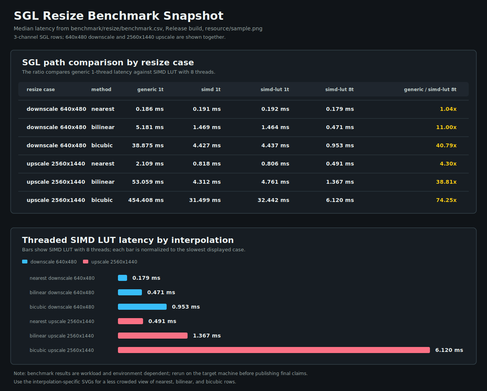
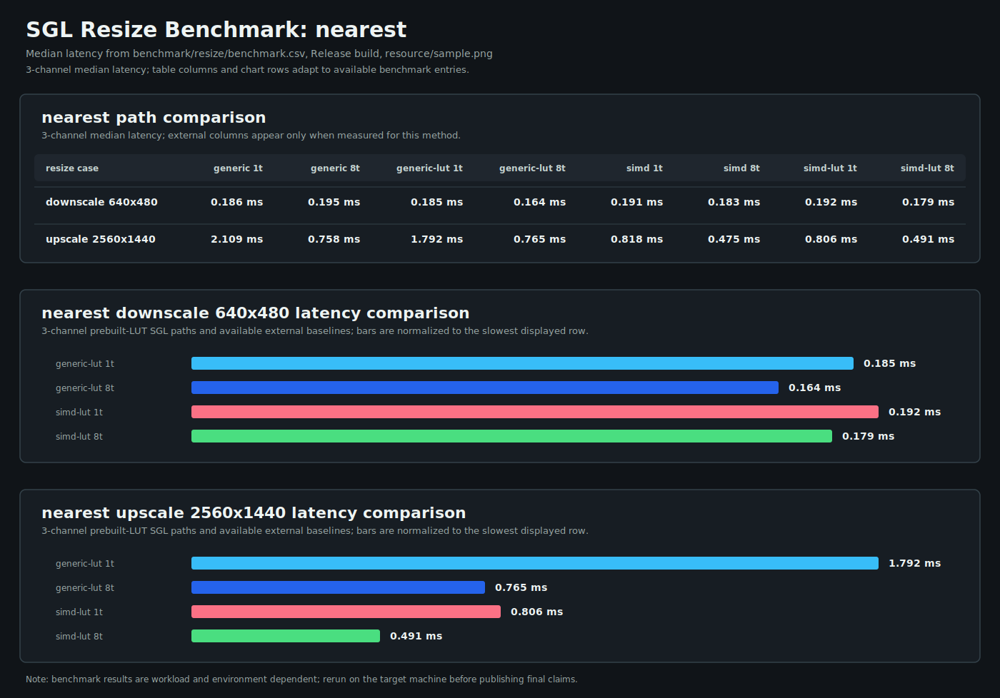
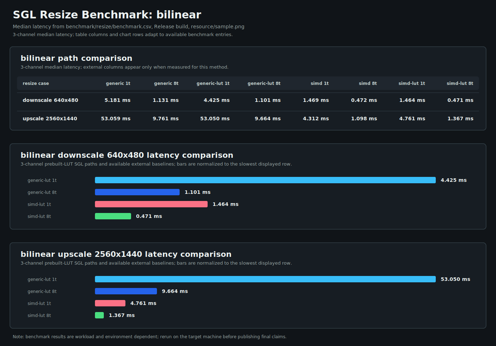
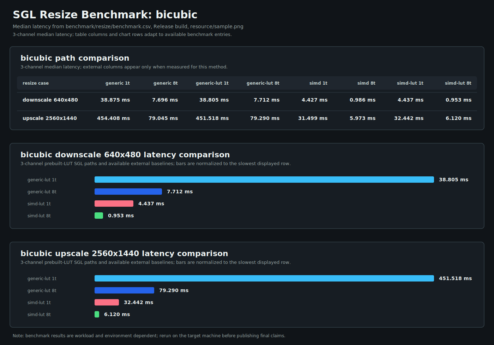

<!--
SPDX-License-Identifier: MIT

Copyright (c) 2025 Dylan Hong

This file is released under the MIT License.
For conditions of distribution and use, see the LICENSE file.
-->

SGL Resize Benchmark: 3 Channels
================================

[Benchmark index](../README.md) | [Main README](../../../README.md#resize-benchmark) | [1 channel](../1ch/README.md) | [2 channels](../2ch/README.md) | **3 channels** | [4 channels](../4ch/README.md)

This report uses `resource/sample-3ch.png`. Cairo and NE10 are omitted because the external comparison paths in this benchmark require 4-channel input.

Overview
--------

Nearest
-------

Bilinear
--------

Bicubic
-------

